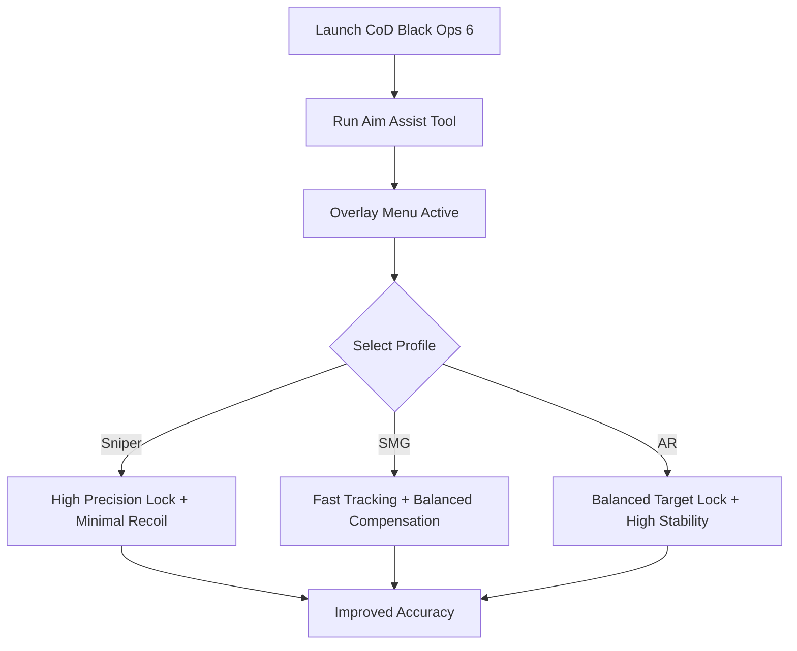

# CoD Black Ops 6 Aim Assist 🎯

**Call of Duty: Black Ops 6** introduces intense multiplayer combat, cinematic campaigns, and a highly competitive ranked scene. Fast reflexes and precise aim make the difference between victory and defeat. The **CoD Black Ops 6 Aim Assist** tool helps you refine your aim with **precision targeting, sensitivity tuning, and modular configs**, designed for Windows players who want more control.

---

## 🌐 Overview

This software provides **adjustable aim assistance** that works alongside your natural skill, helping you track moving targets, reduce recoil impact, and maintain smooth crosshair movement. With customizable profiles, hotkey toggles, and an overlay UI, it’s versatile enough for both casual and ranked play.

---

## 🔑 Features

* 🎯 **Precision Lock** – Smoothly adjusts crosshair tracking on moving targets.
* 🔥 **Recoil Compensation** – Reduces vertical and horizontal recoil drift.
* ⚙️ **Sensitivity Configs** – Customize ADS vs hip-fire sensitivities.
* 🕹 **Hotkey Profiles** – Switch between sniper, SMG, or AR aim modes instantly.
* 👁 **FOV Scaling** – Adaptive targeting based on your field of view.
* 🗂 **Overlay Menu** – Adjust aim assist settings in real time.
* ⌨️ **Keybinding Support** – Assign quick toggles for competitive scenarios.

---

[](#)
[](#)
[](#)
[](#)

---

## 🖥 Compatibility

| Platform          | Status        | Notes                |
| ----------------- | ------------- | -------------------- |
| Windows 10        | ✅ Supported   | Stable builds        |
| Windows 11        | ✅ Optimized   | Best performance     |
| Linux (Proton)    | ⚠️ Partial    | Some configs limited |
| Console (Xbox/PS) | ❌ Unsupported | PC only              |

[!NOTE]
The aim assist software is built exclusively for **Windows PC** players.

---

## ⚙️ Setup Guide

1. Download the **CoD Black Ops 6 Aim Assist** package.

2. Extract into your preferred tools folder.

3. Launch Black Ops 6.

4. Run the tool with admin privileges:

   ```bash
   bo6_aimassist.exe -mode overlay
   ```

5. Open the overlay in-game with `F4`.

6. Edit `aimassist.ini` for custom configs:

   ```ini
   [General]
   SensitivityScale=1.2
   FOVScaling=True

   [Recoil]
   VerticalComp=0.75
   HorizontalComp=0.60

   [Profiles]
   Sniper=PrecisionLock:High, Recoil:Low
   SMG=PrecisionLock:Medium, Recoil:Medium
   AR=PrecisionLock:Balanced, Recoil:High
   ```

7. Use `F1–F3` hotkeys to switch profiles during matches.

[!IMPORTANT]
Always test configs in **private lobbies** before ranked matches to ensure smooth behavior.

---

## 📊 Workflow Diagram



---

## 🎚 Example Configurations

**Sniper Profile:**

```ini
PrecisionLock=High
VerticalComp=0.4
SensitivityScale=0.8
```

**SMG Profile:**

```ini
PrecisionLock=Medium
VerticalComp=0.9
SensitivityScale=1.5
```

**AR Profile:**

```ini
PrecisionLock=Balanced
VerticalComp=0.7
SensitivityScale=1.1
```

[!WARNING]
Overly aggressive assist values may cause unnatural crosshair snapping—tune settings moderately.

---

## ❓ FAQ

**Q: Does it work in multiplayer?**
A: Yes, but configs should be tested offline first to avoid instability.

**Q: Can I use different profiles for each weapon class?**
A: Yes, profiles can be saved and swapped with hotkeys.

**Q: Will it affect FPS?**
A: No, it’s optimized to run lightweight.

**Q: Do updates follow CoD patches?**
A: Yes, tool updates are synced with major patches.

**Q: Can I reset to default settings?**
A: Yes, simply disable the tool or load the reset config.

---

## 🚀 Final Thoughts

The **CoD Black Ops 6 Aim Assist** combines **precision targeting, recoil control, and adaptive sensitivity** into one streamlined package. Whether you’re practicing in casual lobbies or competing in ranked play, it ensures consistent, reliable accuracy when you need it most.

[](#)
[](#)
[](#)

---
